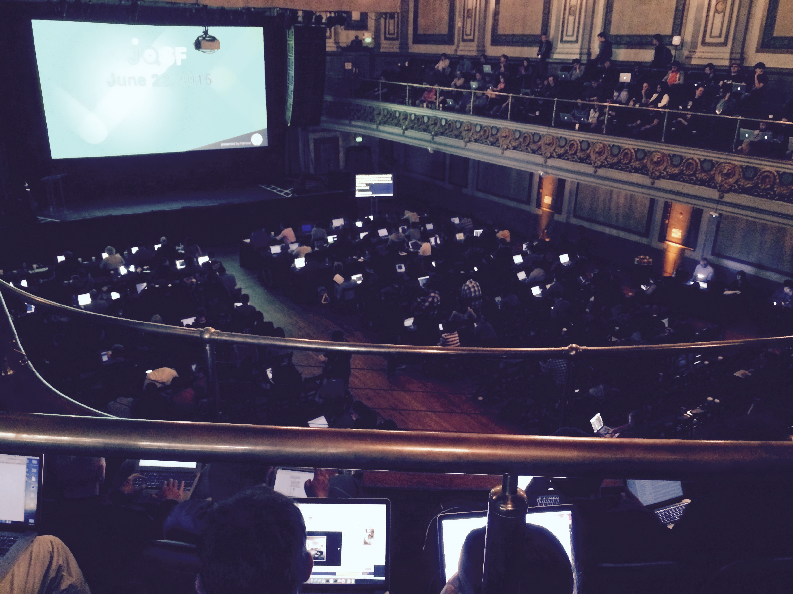

  

So I'm sitting and waiting for Day 2 of the [JQuery SF Conference](<http://jquerysf.com>) to begin. Day 1 was pretty awesome. 

There were many things holding me back from going. I was running on very little sleep and I had a long commute to the city. It was also my very first time traveling solo on BART. The worst part was that I discovered the night before that I can stream the whole thing on YouTube from the comfort of my own home. 

All of those factors made it extremely difficult to get up in the morning and drag my lazy butt to the conference. However, the hubby bear, as usual, decided to be a big pain in the behind and forced me out the door. *Later I found out that he himself went back to sleep and overslept for work...*. 

Once I got to the Regency Ballroom, I saw a long line of men with backpacks and I figured that I must be at the right place.

 

The morning started out slow but the afternoon was amazing. I almost left early but I am so glad that I stayed. The speakers in the afternoon were so inspiring and I actually got to see the guy that created JQuery. While he was talking, I found his AMA on [Reddit](<http://www.reddit.com/r/IAmA/comments/h42ak/i_am_john_resig_creator_of_jquery_ama/>) from a few years ago. He's a cool guy. 

I was also so impressed by watching Victor Tsaran code. Coding and debugging is so challenging for me and he can do it all with a screenreader! 

I would say the highlight was the CEO from [Famo.us](<http://famous.org>). His passion for what he is doing is contagious. I was so excited by what he showed us that I showed my hubby as soon as I got home.

Can't wait to see what today brings!