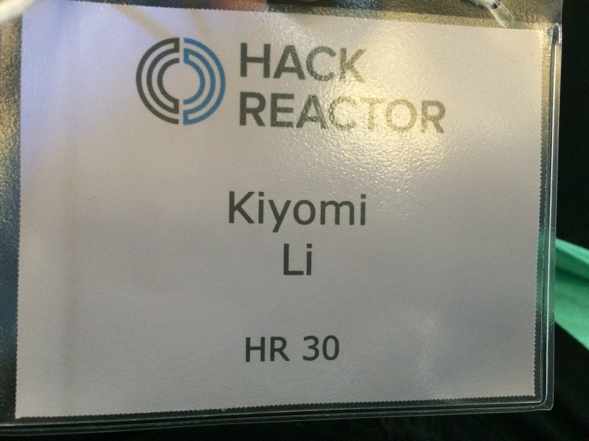
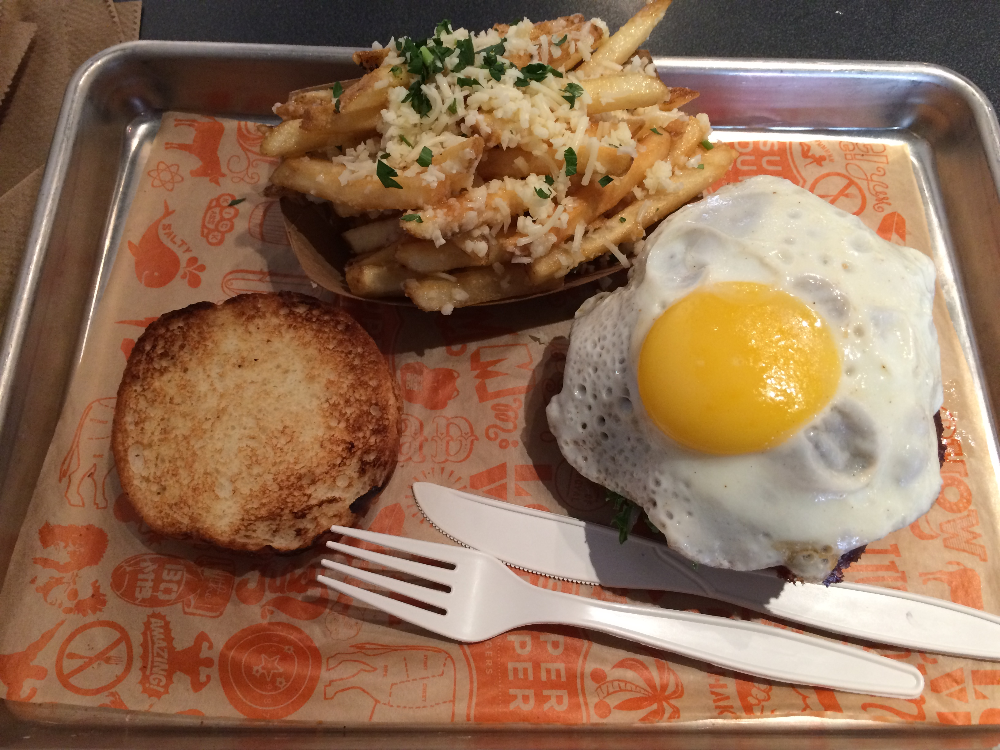

According to my childhood tv experience: SF = Rice A Roni...

Week one of Hack Reactor completed. It was a fun week. I met a lot of awesome people and I feel like I learned a lot. Weird to think that in 12 weeks, all of these people, from crazy diverse backgrounds, will be software engineers. 

Yay! I'm official!

It's also interesting to be back in the city. I lived in the city when I first moved to Northern California and I vowed never to come back. Here I am again... The faint stench of urine in the air and the damp cool summers... 

I do have to say that the downtown area is better than the area that I was in last time. The sun comes out! I can wear a t-shirt! Two things that I wasn't able to say the last summer that I spent here. 

And the food is definitely better up here. 