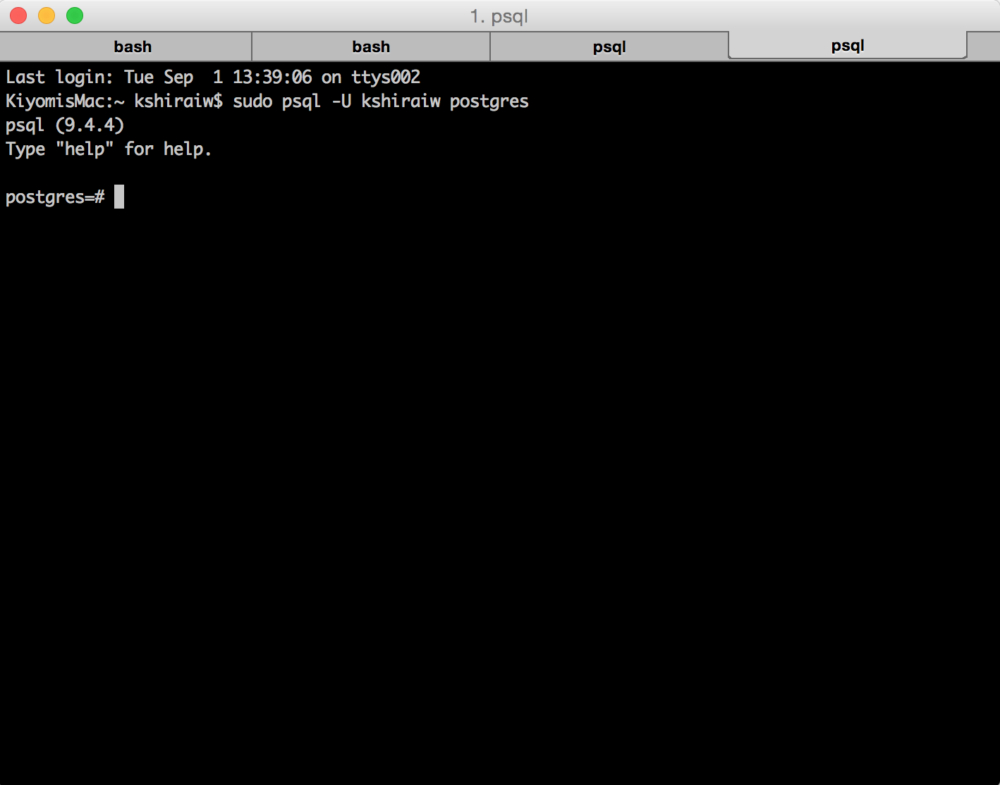

hmm... so let's discuss postgreSQL... My relationship with postgres can be defined as very tumultuous. My struggles began with my hacked Ubuntu computer. For some reason, I could never get postgres to even install on my computer. However, postgres seems to be the relational database of choice due to its ability to handle complexity and its open source nature. 

I was very excited to try postgres on my mac. Everyone told me that postgres would be problem free! My experience has been quite the opposite. After installation, I typed


  psql


and all I received was

  FATAL: database 'root' does not exist


I googled and apparently my problem was a common one. psql by default tries to look for a database that matches your username. However, the fixes were very difficult to find. Most blogs had simply worded directions such as "create a new user".... 

Not exactly helpful.... So here I am with simple directions 

first start your database


  postgres -D /usr/local/var/postgres

Next, in a new tab 


  psql -U 'your username here' postgres


or


  sudo psql -U 'your username here' postgres

This should open up your psql shell and it looks like 

 

then you can enter the usual queries such as CREATE ROLE or CREATE DATABASE

\du -- shows all users
\l  -- shows all databases
\c "database name" -- to alternate between databases
\d "table name"  -- for table schema

To exit, type ctrl + z. The usual ctrl + c does not work here.

Yay! Now everything functions!